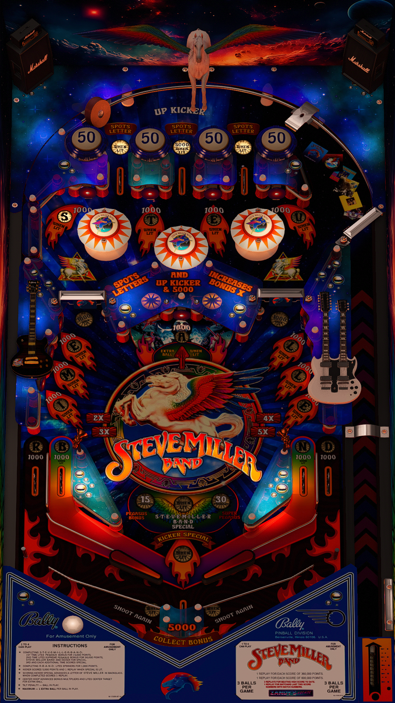

# Steve Miller Band Original (2025)

---

## Files
| File Type | Link | Version | Author | 
|-----------|--------|----------|--------------|
| **VPX** | [VP Universe](https://vpuniverse.com/files/file/24593-steve-miller-band/) | 1.0.2 | [Zandy's Arcade](https://vpuniverse.com/profile/57949-zandysarcade/) | 
| **B2S** | [VP Universe](https://vpuniverse.com/files/file/24593-steve-miller-band/) | 1.0| [Zandy's Arcade](https://vpuniverse.com/profile/57949-zandysarcade/) |
| **DMD** | - | - | - |
| **ROM** | [VP Universe](https://vpuniverse.com/files/file/24593-steve-miller-band/) | slbmania.zip | [Zandy's Arcade](https://vpuniverse.com/profile/57949-zandysarcade/) |

**Tested by:** Bla1ze

---

## Status 
**Minimum VPX Standalone build:** 10.8.0-1983-b84441e
| Playfield | Controls | Backglass | DMD | ROM Required | FPS | 
|-----------|----------|-----------|-----|--------------|-----|
| :white_check_mark: | :white_check_mark: | :white_check_mark: | :x: | :white_check_mark: | 60 |

---

## Instructions
- Install this table through the Table Manager, using the `Add Table` > `Manual` page
- If you need help, more infomation found on the wiki: [TM - Add Table - Manual](https://github.com/LegendsUnchained/vpx-standalone-alp4k/wiki/%5B04%5D-%F0%9F%A7%A1-TM-%E2%80%90-Other-Features#add-table---manual)
- If the table requires any additional files/steps, click `GO TO TABLE` after adding, and the TM will open to the relevant table folder.
- Add a 'music' folder in `external/vpx-stevemiller`, and then copy paste the 'STMILLERB' folder from the 'med/Music' folder in 'MediaPack.zip' there.

